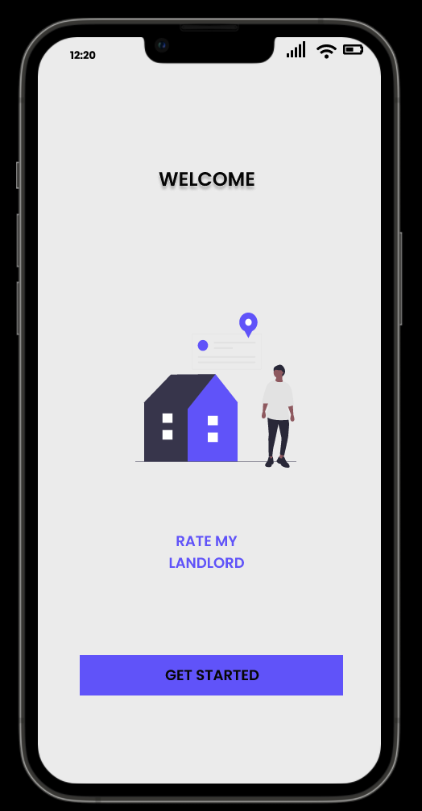
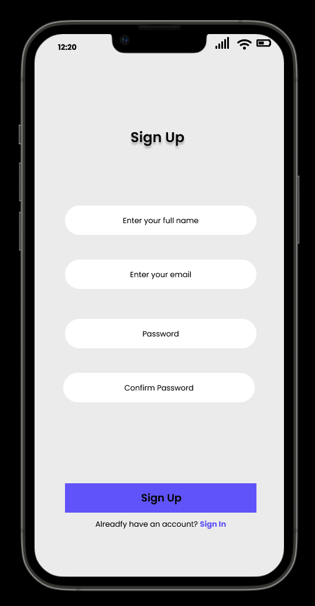
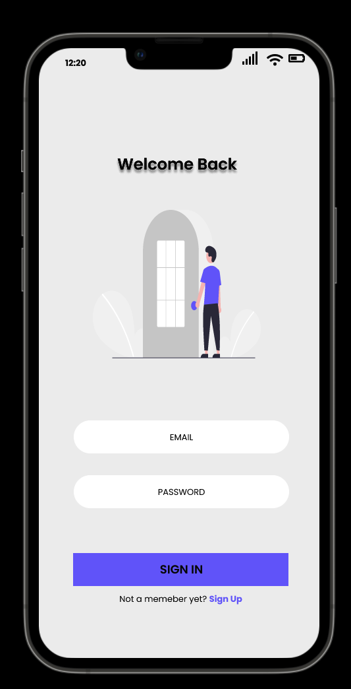
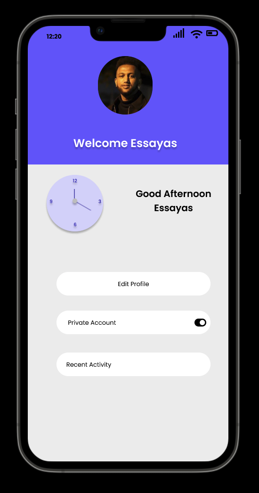
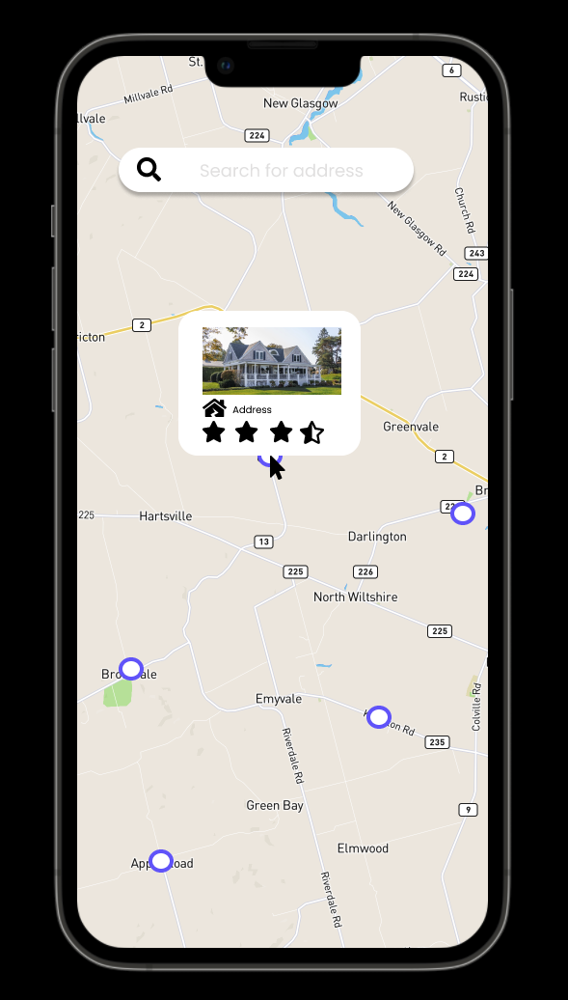
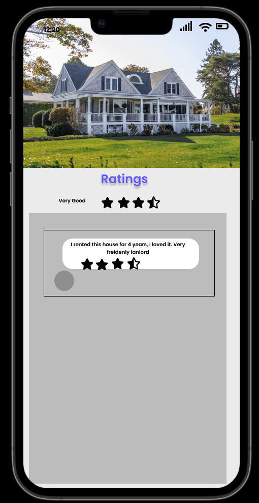

# RATE_MY_Landlord
## _Proposal_

Renting a house or apartment for living can be very challenging when someone just moved in a new city or do not have any idea about the landlords of the city. It is very important to research the landlord before moving in to make the living experience regretless. Our "RATE MY LANDLORD" app will help your research on the landlord easier. You can check the tenant's review for a specific address who is living there or used to live there. You can also post a review for your previous addresses to help others to choose the right place to rent.

## Functionality
We will have five different pages. Registration, Login, User profile, Home and Rating page
- User must **Register** with their email to be able to use the app.   
- Then they have to **Login** to post a review, rate an address and check the reviews
- On the **User profile** page, the information about the user will be shown, such as the registration date, addresses where the user posted a review, etc.
- **Home** page will be the first page which will be previewed to the user right after login. There will be a search bar to search for an address. A map will visually represent the address with a pin right under the search bar with a star-rated popup. The star-rated popup will be shown based on the average user's rating.
- **Rating page** is the page that will appear after selecting the specific address from the map or the list. On top of the page, the average rating bar will be shown, followed by an input field where the user can post a review or rate the address. Users can choose whether to post publicly or anonymously before posting a review. All the reviews posted by the tenants living/ have lived here will also be shown on the rest of the page. 

## General Timeline of Development

We are develping this project using the agile methodology. Estimate timeline of our whole project is given below:- 

- At this current point, we are almost finished gathering all the requirements such as how many pages would be inside the app, what are the features and what not. May be some modifications happen down the road. 
- In Design point of view, we have some prototype images (attached at the bottom) of how the UI would look like. As we said, it's still in progress, final desing may vary from this.
- Then we start coding the actual project. We start by developing the Home/Dashboard page first as it seems to be the most complicated page of them all. Then, we proceed to complete the Ratings page, after that we finish profile, login and register page. 
- Of course, after completing any pages, we would test the code by writing unit test to make sure everything is working as it should.
- We haven't fixed any particular date to complete each section as we don't have enough amount of knowledge to properly estimate the time to implement each features.

## Outside Library/Packages/API
 
| Name | Description |
| ------ | ------ |
| Google Maps Api | For showing the map in our app |
| Firebase | For storing the user and landlord information |
|Font Awesome| For Simple Icon inside the app |
 
>This list can increase if we add new features down the road.

# Sample UI images
  
  
  

